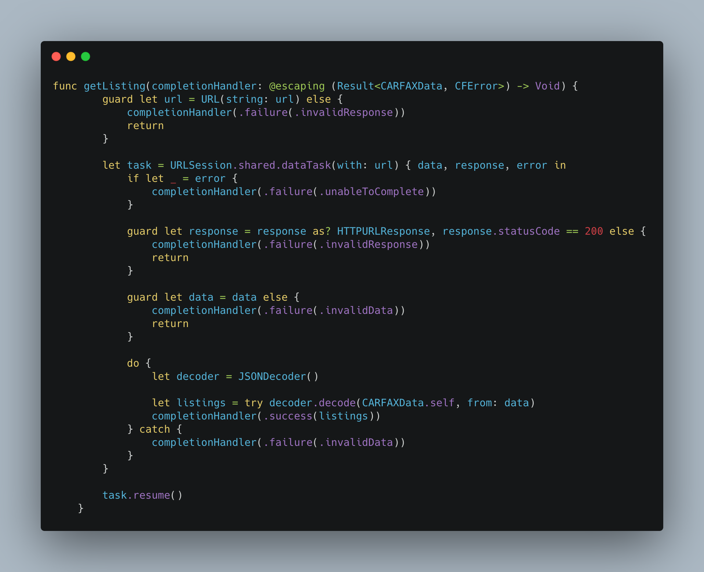
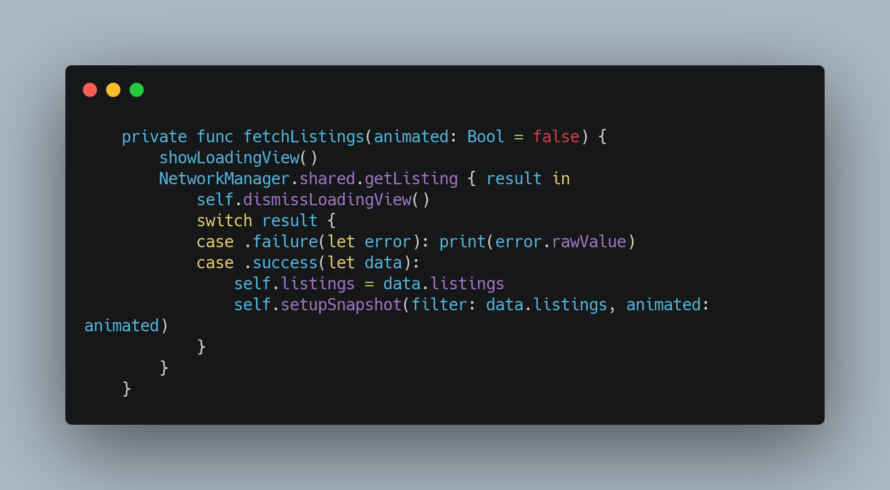

# CARFAX Listing App
## Take Home Project for Interview Purposes
This app was written in its entirety by Chris Song as part of an interview process for CARFAX Canada.

## Technology and Feature Overview
### Diffable Data Source
Diffable Data Source was introduced in WWDC 19. It completely changed the way we as iOS developers look at the very backbone of mobile application: `UICollectionView` and `UITableView`. `NSDiffableDataSourceSnapshot` takes snapshots of the data source and apply the differences to allow for performant and smooth data diffing. With iOS 14, Apple announced further improvements to Diffable Data Source, with features like `NSDiffableDataSourceSectionSnapshot`, `UICollectionViewListCell`, as well as other quality of life changes. The `NSDiffableDataSourceSectionSnapshot` allows not only collapsing and expanding lists, but also for each section to have different data source. `UICollectionViewListCell` and its related APIs come with a strong statement that Apple will move on from `UITableView` by consolidating all core work with `UICollectionView`.

### MapKit and Contacts
MapKit and Contacts frameworks provide convenient way for developers to create postal address objects with `CNMutablePostalAddress` and using that to direct users to Apple Maps.

### Search Controller
Search Controller received an upgrade with iOS 13, and combining that with Diffable Data Source allows for powerful and performant querying task.

### JSONDecoder and Result Type
While there are many powerful 3rd party libraries available to help developers decode JSON objects, `JSONDecoder` accomplishes the same task with minimal hassle and overhead. Pairing `JSONDecoder` and `Result` Type makes `JSONDecoder` even more viable with the ease of returning error types or successful result types after the using `JSONDecoder` to decode the network call.
 

### Context Menu
Also introduced in iOS 13, Context Menu creates a convenient way for users to interact with your app using Force Touch. The relevant context menu APIs that come with `UICollectionView` and `UITableView` make setting up this powerful feature that much easier.
 

### UIMenu and UIAction
With iOS 14, UI elements that inherit from `UIControl` received a welcoming upgrade, which include elements like `UIButton` and `UIBarButtonItem`. Now with the added changes to `UIMenu` and `UIAction` that work along with `UIButton`, `UIBarButtonItem`, and the likes, creating menu elements becomes that much more intuitive and performant.

## Challenges:
### Images
- While each image had the same height and width, the actual content of the image did not properly fill the frame. As such, I noticed some white bars on top and bottom of the images when downloaded from the API, which caused unpleasant viewing experience.
### API 
- API was very complex and complicated, with deeply nested branches within branches.
    - This complexity made data persistence an issue (using Core Data).
    - Firebase would have worked better, but given the nature of the assignment, I opted not to use third party libraries.
    - Solution to this issue was to persist unique ID of the user's selected listing, and on `SavedListingViewController`, I would fetch the listings with my network call, and filter the array of fetched listings by comparing each of the array's element to the persisted managed objects' id.
- Since the API is static, I was not able to make a GET request with specific parameters.
    - As such, I had to be creative with data persistence, which required me to make a network call to fetch the listings and filter the listing by the `id` property that is assigned to each listing.

## Disclaimer:
App Icon image was obtained by CARFAX Car Care App Icon asset, downloaded from [App Store Marketing Tools](https://tools.applemediaservices.com/app/552472249?country=us). CARFAX Logo was obtained from the [CARFAX Website](https://www.carfax.ca). All image assets belong to CARFAX.
